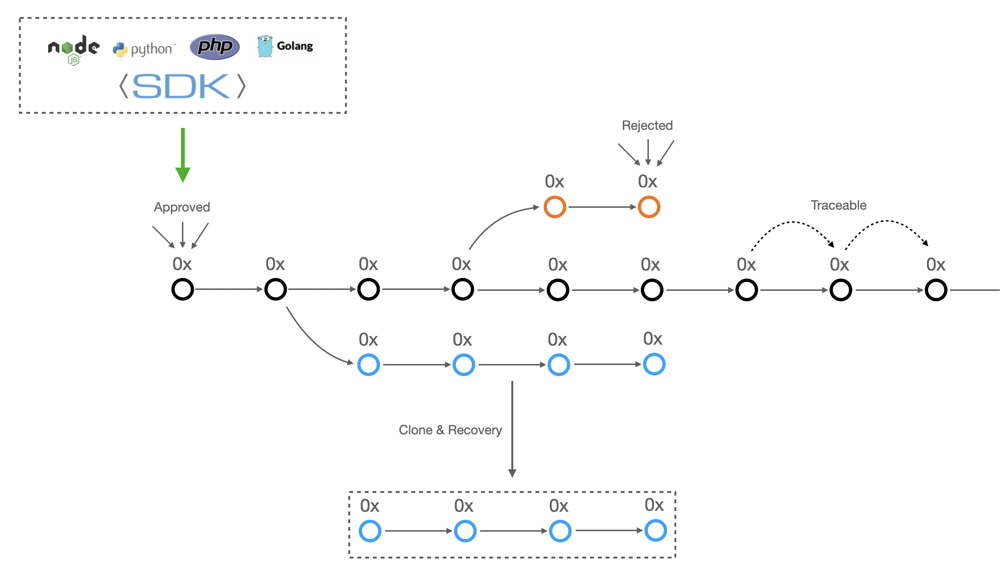

[](https://github.com/james-chien/smartrade-core)


# SmarTrade
The SmarTrade Core is trading consensus platform to simplify communication with blockchains.
Here you'll see the SmarTrade core currently in beta.
This initial implementation is intended for use and review by traders, and will go on to form the basis for decentralized trading network.
The current SmarTrade Core supports:

- easy connectivity of single trade to any relevant trade
- easy to implement voting trade for connecting trade smart contract directly to their poll smart contract
- push notification of smart contract state changes to poll voting, by tracking Ethereum logs
- safest methods for tracking trade documents while trading with participants
- automatic clone mechanism to prevent stuck encrypted data, assuring your data is recoverable in a timely manner
- easy to interact with SDK, which support a wide array of programming languages, and with a ease of development

# Architecture


# Setting up SmarTrade Core

## Ropsten
### v0.1.0-beta

| Contract                                                         | Address                                                                                                                       |
| ---------------------------------------------------------------- | ----------------------------------------------------------------------------------------------------------------------------- |
| REToken ([ERC-721](https://eips.ethereum.org/EIPS/eip-721))                                | [0x7e4b6e1bc877d589141CB5bcAA5De2132226c048](https://ropsten.etherscan.io/address/0x7e4b6e1bc877d589141CB5bcAA5De2132226c048)                                              |
| SmarTradeRegistry                                | [0x9662d88591F01Dd51ED2E73088beCb33FCB49a82](https://ropsten.etherscan.io/address/0x9662d88591F01Dd51ED2E73088beCb33FCB49a82)                                              |
| SmarTradeFactory                                       | [0xF4FFa670be8Ad93e5d7378f37429C477984FbbD5](https://ropsten.etherscan.io/address/0xF4FFa670be8Ad93e5d7378f37429C477984FbbD5)                                              |
| ExpressTrade                                       | Created dynamically                                             |
| SmarPoll                                          | Created dynamically                                               |

## Package version requirements for your machine:

- Node v12+
- npm v6+
- Yarn v1.22+
- Truffle v5.1+ (core: 5.1+)
- Solidity v0.6+
- Ganache CLI v6.10+
- web3.js v1.2+

## Setup

The smart contracts are written in [Solidity](https://github.com/ethereum/solidity) and tested/deployed using [Truffle](https://github.com/trufflesuite/truffle) version 5.1.39. You can run the following:

```bash
# Install local node dependencies
$ yarn

# Run Ganache CLI in another console
$ yarn ganache-cli

# Run migrations for local environment
$ yarn migrate:local
```

## Testing

To test the code simply run:

```bash
# Run tests
$ yarn test

# Run tests with verbose output
$ yarn test:verbose

# Run tests with coverage
$ yarn test:coverage
```

# SmarTrade Core components

1. `REToken` is a blockchain-based asset for representing ownership of real estate tokens, that is, where each token is unique.

2. `SmarTradeRegistry` keeps track of all available trades that create from `SmarTradeFactory` component.

3. `SmarTradeFactory` deploys new trade with approvable poll to give participants the ability to vote their proposals.

4. `ExpressTrade` starts new trade to track all activities from trading platform, including attached documents and comments left by participants.

5. `SmarPoll` allows participants to make decisions to go through new trades within trading.

# Code Styleguide

The smartrade-core repo follows the [Solidity style guide](https://solidity.readthedocs.io/en/latest/style-guide.html).
